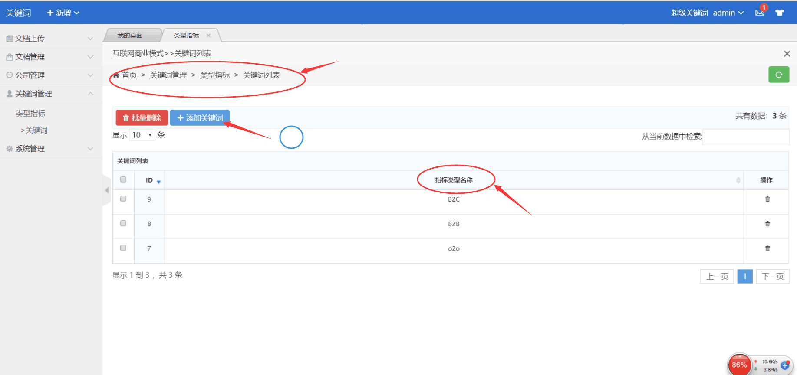

# 关键词分析统计使用说明

[TOC]

## 一、添加关心的公司

在分析前首先要做的工作就是添加需要分析统计的公司：

1. 点击**公司管理**
2. 点击**添加公司**
3. 输入公司的行业名称（可为空）、公司名称（可为空）、**股票代码**（不为空）、**股票名称**（不为空）
4. 点击**提交**即可完成添加

公司列表说明：

1. 下拉**分页**
2. 表示**正在加载数据**，如果**数据过多**可能会需要**较长时间**
3. 点击ID等表头可以进行**排序**
4. 从数据中**检索**
5. 点击**编辑**本条记录
6. 点击**启用**分析本条数据
7. 点击删除本条数据
8. 表示本条数据已**被禁用**

**注**：**3165**个关心的公司已初始化到数据库

## 二、上传需分析的pdf文档

1. 点击**上传文档**
2. 选择**文档所属公司（**默认**自动检测**文档所属公司）
3. 是否**自动检测**文档所属公司
4. 点击**选择文档**或将pdf文档**拖**到此区域

1. **取消上传**该文档
2. 点击**开始上传**
3. 点击**继续添加**

## 三、添加类型指标

1. 关键词管理→类型指标
2. 添加类型指标
3. **点击类型指标名称可以跳转到该类型指标下的关键词管理**

## 四、添加关键词

1. **关键词列表**
2. 在该类型指标下**添加关键词**

## 五、添加邮箱信息

1. 点击系统管理→系统设置
2. 填写SMTP服务器
3. 服务器邮箱账号
4. 邮箱密码
5. 收件邮箱地址
6. 点击保存

**注**：邮箱信息是在分析结束后，服务会将分析报表以邮件的形式发送到目标邮件地址。以上2、3、4为服务器邮箱配置，5为目标邮箱。

## 另：

### （1）文件管理

因为文件数量庞大，响应时间可能会很长，可在数据查看。

### （2）数据规模

**222G+**的pdf文档，**3165**个公司， **40万+**条数据，爬了我两天两夜~ ~

## 项目立项

信息工程学院2018-2019年度创新创业训练项目申报立项的通知
作者： 时间：2018-12-12

 

各创新工作室、各位同学：
为增强学院创新创业氛围，提升创新创业团队建设，培养学生创新实践能力，我院于2018年11月初下发了《信息工程学院2018-2019年度创新创业训练项目申报通知》，截至2018年12月初完成项目申报结果汇总，现将筛选原则和汇总结果通知如下：

本次筛选的主要原则是鼓励和培育能够参加互联网+大赛的项目，针对应用类、创业类、本科生组项目给予优先考虑，重复申报或已资助过同类项目的原则上不再立项

本次创新创业训练项目申报共收到申报项目书67项，其中本科生组25项，研究生组42项；经学院教研室匿名推选及学院创新创业工作领导小组审核，最终认定立项项目数为34项，其中本科生组20项，研究生组14项，符合项目级别等级有：A类4项、B类6项、C类9项、D类15项。

特此通知！
                                                                                                                                                                              信息学院创新创业工作领导小组
                                                                                                                                                                                   2018年12月12日
                                                                                                                                                                                 

---
***

                                                                                                                                                                                 